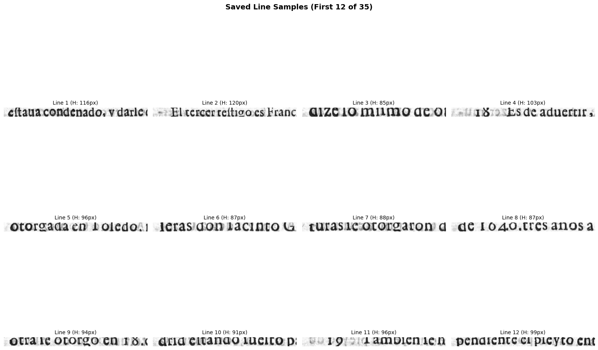
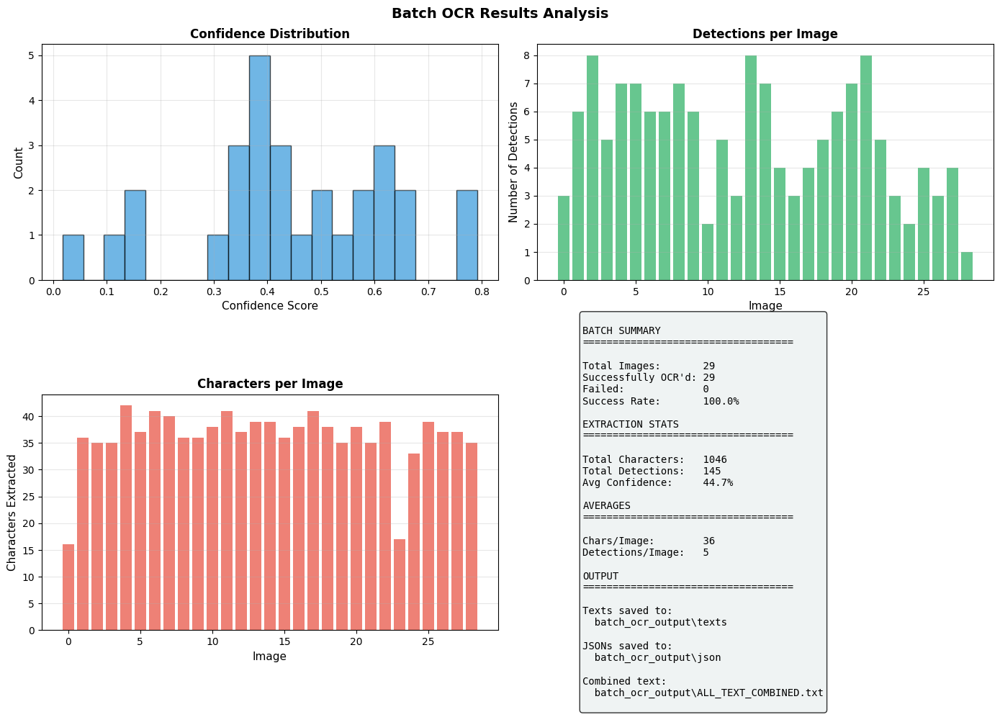

# Historical Document OCR: CNN-RNN with LLM Integration

**GSOC 2026 Test | HumanAI Foundation | RenAIssance Project**

This repository contains a complete implementation of a hybrid CNN-RNN architecture 
with LLM post-processing for Optical Character Recognition (OCR) of historical 
Renaissance-era printed documents, specifically targeting 17th-century Spanish texts.

## Material

- [Test detail](https://humanai.foundation/assets/GSoC%202026%20tests.pdf)

- [Source of data](https://bama365-my.sharepoint.com/personal/xgranja_ua_edu/_layouts/15/onedrive.aspx?id=%2Fpersonal%2Fxgranja%5Fua%5Fedu%2FDocuments%2FUA%2F1%2E%20Research%2FAI%2FHumanAI%2FGSoC%2026%2F0%2E%20Test%2FTest%20sources&viewid=aeb9535d%2D9751%2D4642%2D912a%2Dc16ad99be40c)

### Characters in Spanish Language
> BASIC ALPHABET:

    a b c d e f g h i j k l m n ñ o p q r s t u v w x y z

    A B C D E F G H I J K L M N Ñ O P Q R S T U V W X Y Z

>ACCENTED VOWELS (Most Common):

    á é í ó ú
    Á É Í Ó Ú

> N WITH TILDE (Most Important):

    ñ Ñ

> U WITH DIAERESIS (Common):

    ü Ü

> GRAVE ACCENTS (Rare):

    à è ì ò ù ſ
    À È Ì Ò Ù

> SPANISH PUNCTUATION:

    ¿ (opening question)
    ? (closing question)
    ¡ (opening exclamation)
    ! (closing exclamation)

> ORDINALS:

    ª (feminine)
    º (masculine)
    ° (degree)

> NUMBERS:

    0 1 2 3 4 5 6 7 8 9

> COMMON SYMBOLS:

    . , ; : - " ' ( ) [ ] { } @ # $ € + - × ÷ = % & / \ ~

# Dataset
This model is trained on 6 book
- **Buendia_Instruccion**
- **Covarrubias_Tesoro_lengua**
- **Guardiola_Tratado_nobleza**
- **PORCONES_23_5_1628**
- **PORCONES_228_38_1646**
- **PORCONES_748_6_1650**

> These books are in printed text.

> These books are in Spanish Language.

# Abstract
Most OCR tools like Adobe and CamScanner fail to detect text from old book that contain faded ink and low quailty pages.

# Solution
A Machine Learning model is trained on old books page so it able to detect text even in old books pages very accuartly.

# Methods
- ✓ CNN-RNN
- ✓ Wighted CNN-RNN
- ✓ Transformers
- ✓ LLM Integration (*) - Most Important
     > I achieved 98-100% accuaracy in Test during Transcrption using Gemini Model.

# Most Important Problems
- Previous model consider Spanish word long s 'ſ' as **s**.
- Consider **ñ** as simple **n**.
- Consider **á** as **a**
- O -> 0
- Also **ſ** consider **f** by most OCR models.

    > ⚠️ I spend a lot of time fix these character manually or using LLM to prepare a good dataset.

# Further Work after making model.

- A mobile app like CamScanner
- A Web interface
- A docker container

### Gallery

