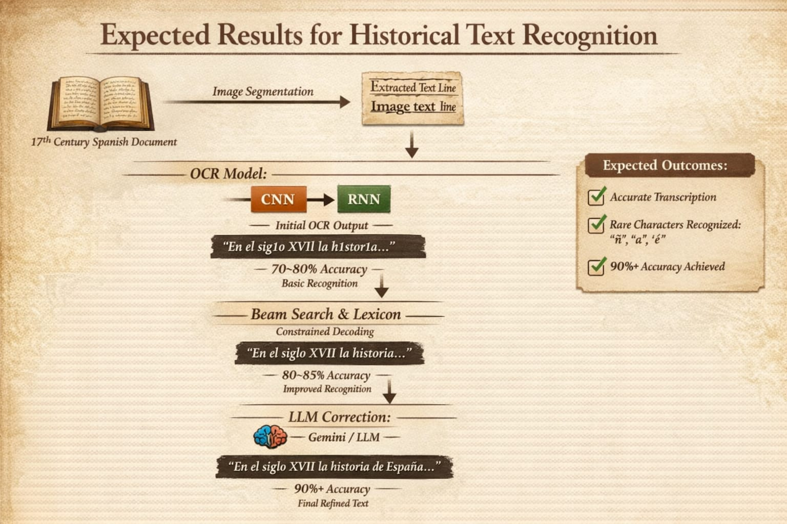
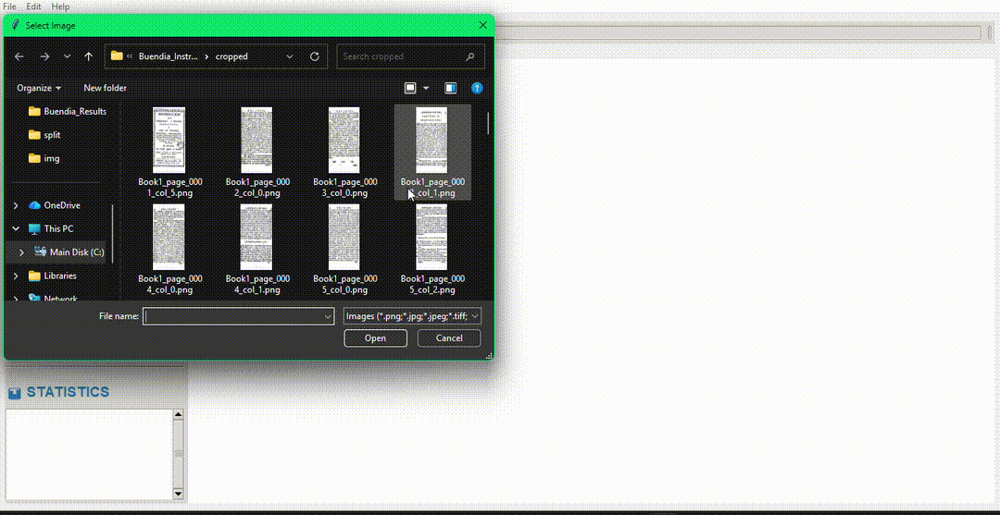
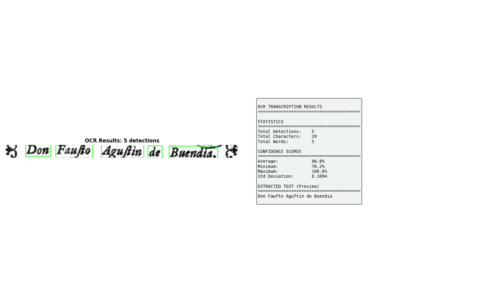
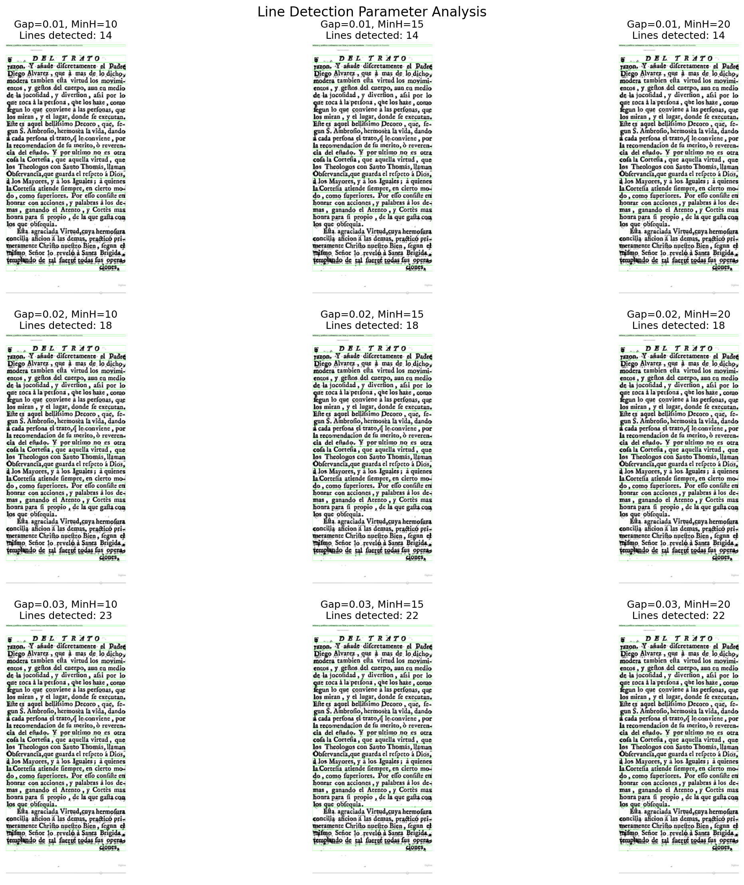

# RenAIssance OCR Pipeline for Historical Spanish Documents

This repository contains a notebook-first OCR workflow for Renaissance-era and early modern Spanish printed books. The project covers end-to-end processing: converting source PDFs to images, preprocessing noisy scans, segmenting text lines, training OCR models, and producing final transcriptions.


### LLM Test(Gemini 3)


## Project Scope

The pipeline is designed for challenging historical pages where modern OCR systems often fail due to:

- faded ink and low-contrast scans,
- long-s glyphs (`ſ`),
- diacritics and legacy punctuation,
- column-based page layouts.

The workflow combines classical image processing, deep learning OCR, and optional LLM-assisted post-correction for higher transcription quality.

## Dataset
1. Book1
    - [Pages](https://drive.google.com/drive/folders/1EnlJBAcCV2-vDwQq1G1nio1lTGvOjgQz?usp=drive_link)
    - [Transcription](https://docs.google.com/spreadsheets/d/1cWy2J-GFhK7SF1KE4ZHWmSl6fRJ7i9ub/edit?usp=drive_link&ouid=106716551578912679442&rtpof=true&sd=true)
    - [Split](https://drive.google.com/drive/folders/1QluBLTwX0y5QmJQEjBrZMu6VwSwByTW1?usp=drive_link) - Data splitted in `train`, `test` and `val` for model training.

## Notebook Workflow

The core work is organized in the `notebooks/` directory and intended to be executed in sequence:

1. **`pdf_to_images.ipynb`**  
   Builds the image dataset from source PDFs and applies page-level cropping for multi-column layouts.

2. **`preprocessing.ipynb`**  
   Applies preprocessing steps to improve readability before segmentation and OCR.

3. **`segmentation.ipynb`**  
   Detects and crops individual text lines from page images, including folder-level processing utilities.

4. **`training.ipynb`**  
   Trains the OCR model used for historical text recognition.

5. **`transcription.ipynb`**  
   Runs inference/transcription (CPU and GPU paths are included) and supports final text extraction workflows.

## Repository Layout

```text
notebooks/            End-to-end OCR pipeline notebooks
Scripts/              Script versions of preprocessing and OCR utilities
config/               YAML configuration files
apps/                 Demo app entry points
tests/                Sample assets and outputs for validation
img/                  Visual assets used in documentation
```

## Environment Setup

### 1) Create and activate a virtual environment

```bash
python -m venv .venv
source .venv/bin/activate
```

### 2) Install dependencies

```bash
pip install -r requirements.txt
```

### 3) Launch Jupyter

```bash
jupyter lab
```

Then open notebooks in `notebooks/` and run them in the workflow order above.

## Data and Character Coverage

The OCR target domain is historical Spanish printed text, including:

- `ñ`, accented vowels (`á é í ó ú`), and diaeresis (`ü`),
- long-s (`ſ`) and legacy punctuation,
- common symbols and numeric tokens seen in book scans.

For additional character references, see `CHARACTER SET.txt`.

## Visual Examples





## Acknowledgment

Developed as part of the **GSoC 2026 test context** under the HumanAI Foundation RenAIssance effort.

## License

This project is distributed under the terms defined in `LICENCE`.
